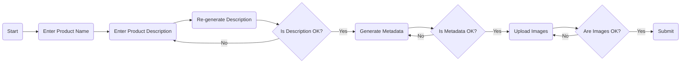

# semantic-kernel-workshop
semantic kernel workshop

## Seller Process Flow

```mermaid
flowchart LR
    Start(Start) --> EnterProductName(Enter Product Name)
    EnterProductName --> EnterProductDescription(Enter Product Description)
    EnterProductDescription --> ReGenerateDescription(Re-generate Description)
    ReGenerateDescription --> ReviewDescription{Is Description OK?}
    ReviewDescription -- Yes --> GenerateMetadata(Generate Metadata)
    ReviewDescription -- No --> EnterProductDescription
    GenerateMetadata --> ReviewMetadata{Is Metadata OK?}
    ReviewMetadata -- Yes --> UploadImages(Upload Images)
    ReviewMetadata -- No --> GenerateMetadata
    UploadImages --> ReviewImages{Are Images OK?}
    ReviewImages -- Yes --> Submit(Submit)
    ReviewImages -- No --> UploadImages 
```
