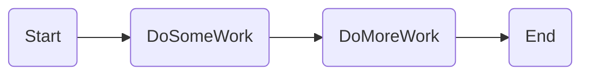
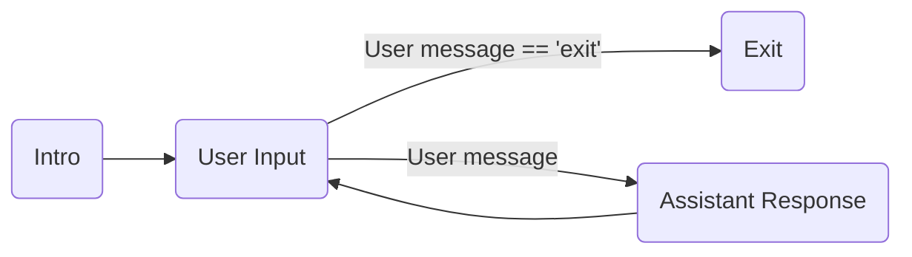
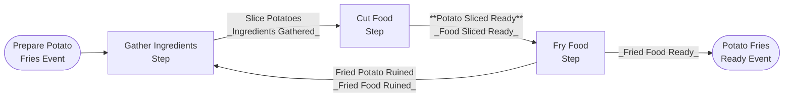
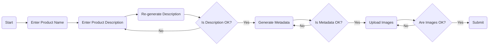

# Semantic Kernel process flow

## Potato Fries Preparation Process

## Seller Process Flow

More Info

https://learn.microsoft.com/en-us/semantic-kernel/frameworks/process/process-framework
https://github.com/microsoft/semantic-kernel/tree/main/dotnet/samples/GettingStartedWithProcesses
